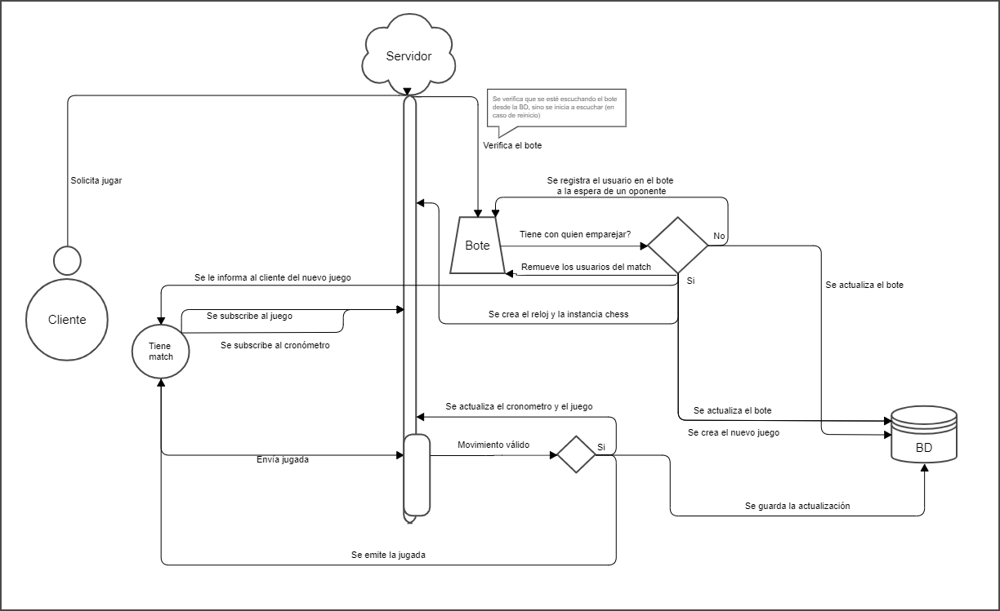

# Servidor ChessColate sockets.<!-- omit in toc -->

### Tabla de Contenido<!-- omit in toc -->

- [1- Narrativa](#1--narrativa)
- [2- Diagrama](#2--diagrama)
- [3- Sockets](#3--sockets)
    - [1_in_matchEngine_requestGame (userRequestToPlay):](#1_in_matchengine_requestgame-userrequesttoplay)
    - [2_out_matchEngine_readyMatch(game)):](#2_out_matchengine_readymatchgame)
    - [3_in_game_move(move):](#3_in_game_movemove)
    - [4_out_game_move(move):](#4_out_game_movemove)
- [4- Modelos](#4--modelos)
    - [userRequestToPlay](#userrequesttoplay)
    - [game](#game)
    - [clock](#clock)
    - [chessInstance](#chessinstance)
    - [move](#move)


## 1- Narrativa

Todo comienza cuando un usuario solicita ser emparejado para un juego mediante un evento a travez de un socket ([1_in_matchEngine_requestGame](#1_in_matchengine_requestgame-userrequesttoplay)). 
Cuando el servidor recibe la solicitud, se verifica que se este escuchando el 'bote' (es un arreglo con objetos [userRequestToPlay]#userrequesttoplay) ) desde firebase, y si no se esta escuchando, se realiza el llamado para cargar el estado del bote. Posteriormente,
se verifica si en el bote se tiene otro usuario con el que se pueda realizar el match. Si no se tiene, se adiciona el usuario al bote y queda a la espera de que llegue otros usuario con el que se pueda emparejar. Si se ha logrado emparejar, se crea una [partida](#game) y se envía la información de la partida a los  usuarios del match por otro socket ([2_out_matchEngine_readyMatch](#2_out_matchengine_readymatchgame)) , y se remueven los usuarios del bote.
A su vez se registra la partida en firebase y se crea el reloj (se almacena en un arreglo [clock](#clock)) para la partida.
Luego se crea un objeto ([chessInstance](#chessinstance)) que se almacena en un arreglo para realizar validaciones sobre los movimientos enviados para la partida.

Enviar jugada:
La jugada se recibe por el socket [3_in_game_move](#3_in_game_movemove) se procesa según el objeto ([chessInstance](#chessinstance)), si es valida, se detiene el reloj y se envía la jugada al otro usuario; emitiendo la jugada por el socket [4_out_game_move(move):](#4_out_game_movemove). Si no es valida, se envía un mensaje de error al usuario por ese mismo socket (por definir estructura de error).
Se modifica la partida en firebase y se actualiza el reloj correspondiente.

## 2- Diagrama



## 3- Sockets
#### 1_in_matchEngine_requestGame ([userRequestToPlay](#userrequesttoplay)): 
Cuando un usuario solicita emparejarse para jugar.

#### 2_out_matchEngine_readyMatch([game](#game))):
Comunica al usuario que se ha emparejado con otro usuario. y envía la información de la partida.

#### 3_in_game_move([move](#move)):
Recibe la jugada que debe ser procesada para una partida en especifico

#### 4_out_game_move([move](#move)):
Emite una jugada realizada en una partida

## 4- Modelos

#### userRequestToPlay
```
     - uidUser: string;
     - time: number; // tiempo para el juego ejm: 10 minutes
     - lang: string; // 2 caracteres
     - elo: number;
     - color: white | black | random;
     - country: string; // 3 caracteres
     - createAt: number; //(auto generado al ingresar al bote) / fecha para dar prioridad si lleva mucho tiempo esperando
```

#### game 
```
    - uid: string //(auto generado)
    - uidUserWhite: string;
    - uidUserBlack: string;
    - timeControl: number; // tiempo para el juego ejm: 10 minutes
    - createAt: number;
    - uidClock: string; //(auto generado)
    - uidChessInstance: string; //(auto generado)
```

#### clock
```
    - uid: string //(auto generado)
    - uidGame: string;
    - timerWhite: any; // objeto timeOut
    - timerBlack: any; // objeto timeOut
```

#### chessInstance
```
    - uid: string //(auto generado)
    - chessInstance: any;
    - uidGame: string;
    - fens: string[];
    - moves: string[];
```

#### move
```
    - uid: string //(auto generado)
    - uidGame: string;
    - uidUser: string;
    - move: string;
    - createAt: number;
```